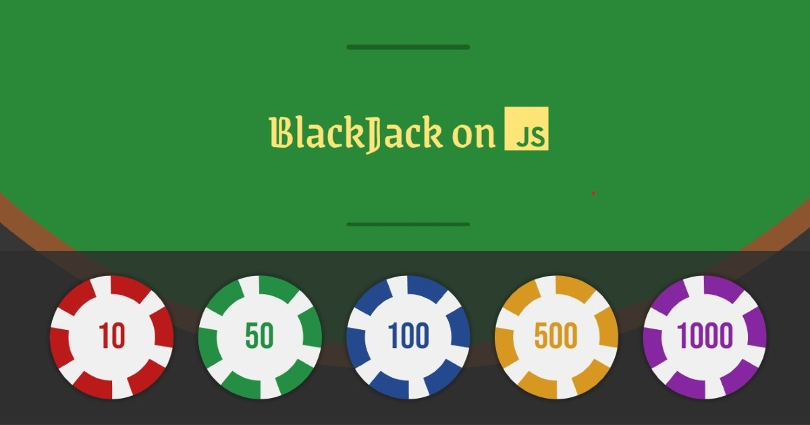

# BlackJack on Javascript  
A basic web application of Blackjack written only with Javascript, HTML, and CSS. This project is inspired from 
<a href="https://scrimba.com/learn-javascript-c0v">Per Borgen's Javascript course in Scrimba.<a>

## First project and it's a gambling game.
I made a couple of improvements from Per's original Blackjack game as well as add features that were missing.
### Improvements:
1. User Interface
2. Monetary/Chip System
3. Win/Lose Situations

### Added Features:
1. User Actions
   * Double Down
   * Hit
   * Stand
2. Betting System
3. Reset Bank
4. Card Design
   * Added suits
5. Basic Animations

## Try the game.

  <a href="https://smdev-blackjack.netlify.app/">
    
  <a>

