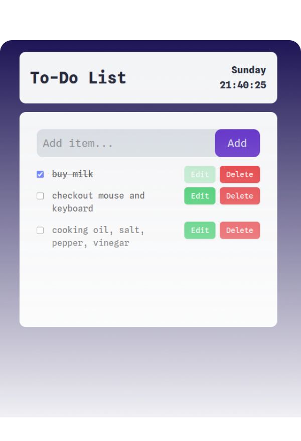

# roadmap.sh-projects

Contains all submitted projects and solutions on front-end development in roadmap.sh.

## roadmap.sh

<a href="https://roadmap.sh/projects/single-page-cv" style="margin-left: auto">Single-Page CV</a> -
<a href="https://roadmap.sh/projects/basic-html-website" style="margin-left: auto">Basic HTML Website</a> -
<a href="https://roadmap.sh/projects/portfolio-website" style="margin-left: auto">Portfolio Website</a>

  

    
    
    
  

## Related Projects

  

    
    
    
  

