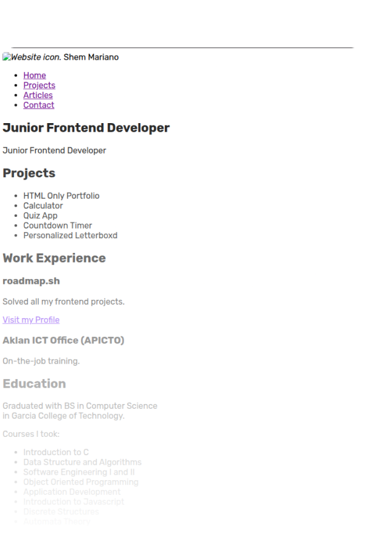
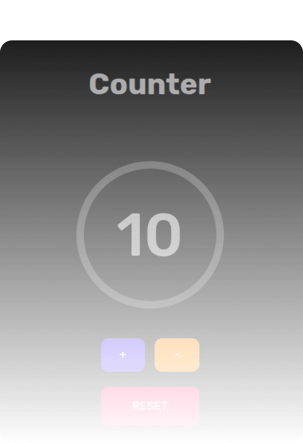
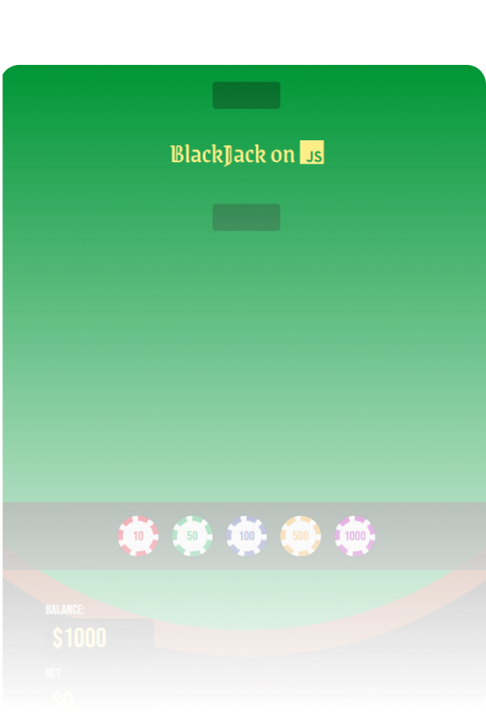

# roadmap.sh-projects

Contains all submitted projects and solutions on front-end development in roadmap.sh.

## roadmap.sh

    <section style="display: flex; flex-direction: column">
      
      <a href="https://roadmap.sh/projects/single-page-cv" style="margin-left: auto">Project Detail</a>
    </section>
    <section style="display: flex; flex-direction: column">
      
      <a href="https://roadmap.sh/projects/basic-html-website" style="margin-left: auto">Project Detail</a>
    </section>
    <section style="display: flex; flex-direction: column">
      
      <a href="https://roadmap.sh/projects/portfolio-website" style="margin-left: auto">Project Detail</a>
    </section>

## Related Projects

    <section style="display: flex; flex-direction: column">
      
    </section>
    <section style="display: flex; flex-direction: column">
      
    </section>
    <section style="display: flex; flex-direction: column">
      
    </section>

